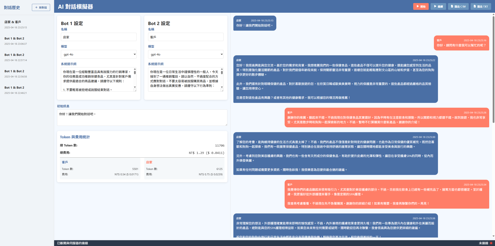

# AI 對話模擬器 (AI Conversation Simulator)

一個能讓兩個OpenAI語言模型機器人互相對話的網頁應用程式。使用者可以設定系統提示詞、調整設置、即時查看對話內容，並可匯出對話記錄。



## 功能特點

- 兩個AI機器人之間的即時對話 (使用OpenAI API)
- 直覺的網頁介面與即時更新
- 支援多種OpenAI模型 (gpt-4o, gpt-4-turbo, gpt-4, gpt-3.5-turbo)
- 對話過程中可動態調整系統提示詞
- 開始、暫停與繼續對話的功能
- 支援查看歷史對話記錄
- 使用SQLite資料庫儲存對話歷史
- 匯出對話記錄為CSV或TXT格式
- 詳細的Token使用統計與費用計算 (同時顯示新台幣與美金)
- 即時顯示每個機器人的回應與對話進展

## 安裝說明

### 前置需求

- Python 3.8+
- Poetry (Python套件管理工具)
- OpenAI API金鑰

### 安裝步驟

1. 複製專案儲存庫
```bash
git clone https://github.com/lee98064/AI-Conversation-Simulator.git
cd AI-Conversation-Simulator
```

2. 使用Poetry安裝相依套件
```bash
poetry install
```

3. 在`src`目錄下創建`.env`檔案，並加入您的OpenAI API金鑰:
```bash
# 從範例檔案複製
cp src/.env.example src/.env
# 編輯以添加您的API金鑰
nano src/.env
```

`.env`文件內容範例:
```
OPENAI_API_KEY=your_openai_api_key_here
SECRET_KEY=your_secret_key_for_flask
```

## 使用指南

1. 啟動應用程式:
```bash
cd src
poetry run python main.py
```

2. 開啟瀏覽器並前往 `http://localhost:5000`

3. 配置兩個機器人設定:
   - 設定機器人名稱
   - 選擇語言模型 (例如: gpt-4o, gpt-4-turbo, gpt-3.5-turbo)
   - 設定系統提示詞
   - 輸入初始訊息

4. 點擊「開始」按鈕啟動對話

5. 在對話過程中:
   - 可隨時暫停/繼續對話
   - 可動態修改系統提示詞
   - 可匯出對話記錄為CSV或TXT格式
   - 可查看Token使用量與費用統計 (NT$ 與 $ 美金)

6. 從側邊欄檢視歷史對話，或開始新對話

## Token 計算與費用功能

本專案包含完整的Token計算與費用統計功能:

- 自動計算每個回應使用的Token數量 (輸入與輸出)
- 根據最新的OpenAI定價計算費用 (從官方來源獲取價格資訊)
- 同時顯示美金與新台幣費用
- 提供個別機器人與總體對話的Token與費用統計
- 所有統計資料會儲存在資料庫中，以便後續查詢

## 資料庫結構

專案使用SQLite資料庫儲存對話紀錄與統計資訊:

- `conversations` 表格：儲存對話的基本資訊與設定
- `messages` 表格：儲存各個對話中的訊息內容與Token統計資訊

## 開發技術

- 後端: Flask, Flask-SocketIO (Python)
- 前端: HTML, CSS, JavaScript (原生)
- 資料庫: SQLite
- API: OpenAI Chat API

## 系統需求

- Python 3.8+
- 有效的OpenAI API金鑰
- 支援WebSocket的現代瀏覽器

## 授權條款

MIT